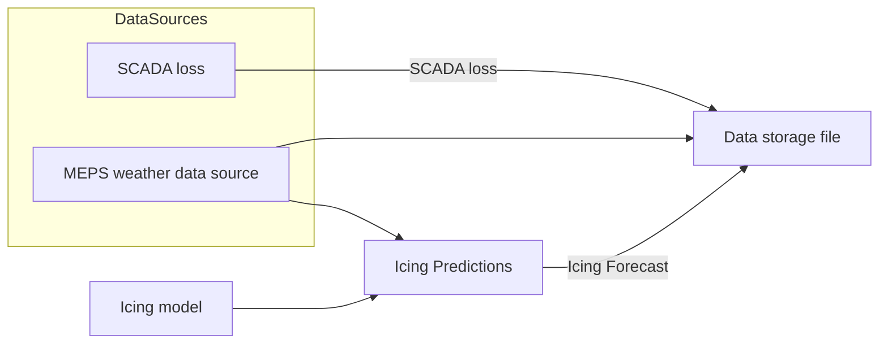

# Icing Forecasting System

This repository contains flowcharts describing the data flow and model pipeline for icing forecasting.

---

## Flowchart 1: Data Flow

# Icing Forecasting System

This repository contains flowcharts describing the data flow and model pipeline for icing forecasting.

---

## Flowchart 1: Data Flow



---

## Flowchart 2: Model Training Pipeline

```mermaid
flowchart TD
    DSF[Data storage file] -->|2022-2023, 2024-2025| TrD[Training data]
    DSF -->|2023-2024| TeD[Test data]

    LF[Choice of Loss Function] --> FT
    TrD --> FT((Finetuning)) --> OM(Optimised model)
    OM --> TR((Training))
    TrD --> TR
    TR --> TM[Trained Model]

    TM --> MoPr[Model Predictions]
    TeD -->|Weather, Icing data and SCADA loss lead hour 0| MoPr
    MoPr --> EvR[Evaluation Results]
    TeD -->|SCADA loss| EvR


