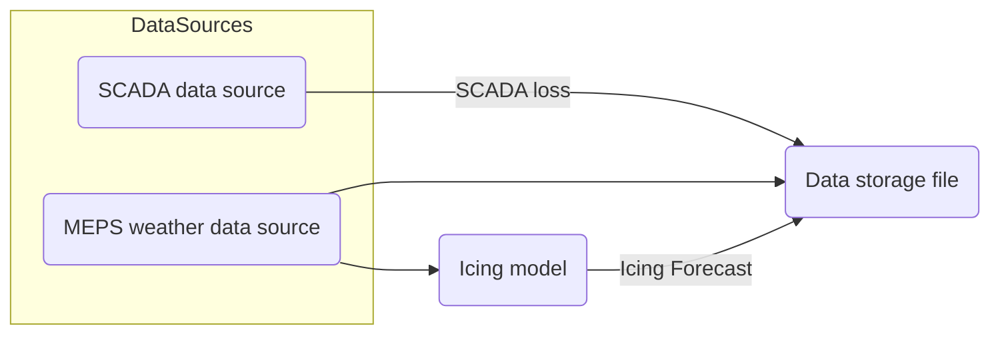

# Icing Forecasting System

This repository contains flowcharts describing the data flow and model pipeline for icing forecasting.

---

## Flowchart 1: Data Flow



---

## Flowchart 2: Model Training Pipeline

```mermaid
flowchart LR
    DSF(Data storage file) -->|2022-2023, 2024-2025| TrD(training data)
    DSF -->|2023-2024| TeD(test data)
    TrD -->FT([Finetuning])
    FT --> OM(Optimised model)
    OM --> TR([Training])
    TrD --> TR([Training])
    TR --> TM(Trained Model)
    TeD --> |Weather + Icing data (+ SCADA loss from lead hour 0)|MoPr(Model Predictions)
    MoPr --> EvR(Evaluation Results)
    TeD --> |SCADA loss|EvR    
```

