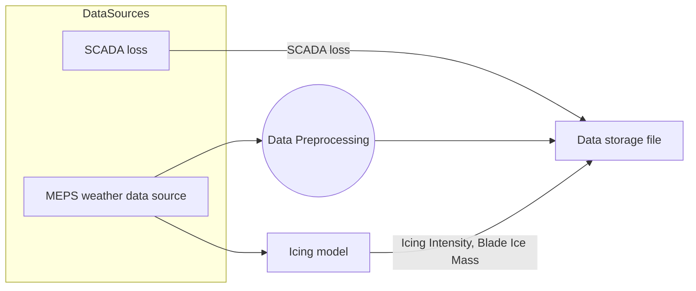

# Icing Forecasting System

This repository contains flowcharts describing the data flow and model pipeline for icing forecasting.

---

## Flowchart 1: Data Flow

# Icing Forecasting System

This repository contains flowcharts describing the data flow and model pipeline for icing forecasting.

---

## Flowchart 1: Data Flow



---

## Flowchart 2: Model Training Pipeline

```mermaid
flowchart TD
    DSF[Data storage file] -->|2022-2023, 2024-2025| TrD[Training data]
    DSF -->|2023-2024| TeD[Test data]

    LF[Choice of Loss Function] --> FT
    TrD --> FT((Finetuning)) --> OM(Optimised model)
    OM --> TR((Training))
    TrD --> TR
    TR --> TM[Trained Model]

    TM --> MoPr[Model Predictions]
    TeD -->|Weather, Icing data and SCADA loss lead hour 0| MoPr
    MoPr --> EvR[Evaluation Results]
    TeD -->|SCADA loss| EvR

flowchart TD

    %% === Files ===
    subgraph Files
        CSV[📄 CSV data file]
        MODEL_JSON[📄 Model spec JSON]
        TRAINED_MODELS[📄 Trained models (.pkl/.json)]
    end

    %% === CSV creation and update ===
    A[1️⃣ Create CSV data file] --> CSV
    CSV --> B[2️⃣ Update CSV data file]
    B --> CSV  %% loop: update leads to new version of the same file

    %% === Model specification setup ===
    C[3️⃣ Write model specs to JSON file] --> MODEL_JSON

    %% === Execution script ===
    D[4️⃣ Run tune_and_train.py]
    D --> E[5️⃣ Load CSV file for training]
    E --> CSV

    D --> F[6️⃣ Write or overwrite model spec JSON]
    F --> MODEL_JSON

    D --> G[7️⃣ Load model specs into regressors]
    G --> MODEL_JSON

    G --> H[8️⃣ Tune models and update JSON]
    H --> MODEL_JSON

    H --> I[9️⃣ Train models]
    I --> J[🔽 Save trained models]
    J --> TRAINED_MODELS

    J --> K[🔎 11️⃣ Evaluate models]


