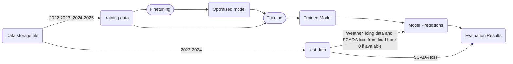

# Icing Forecasting System

This repository contains flowcharts describing the data flow and model pipeline for icing forecasting.

---

## Flowchart 1: Data Flow

# Icing Forecasting System

This repository contains flowcharts describing the data flow and model pipeline for icing forecasting.

---

## Flowchart 1: Data Flow

---

## Flowchart 2: Model Training Pipeline

