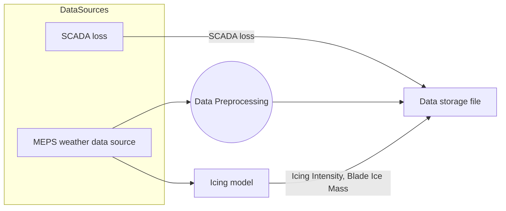
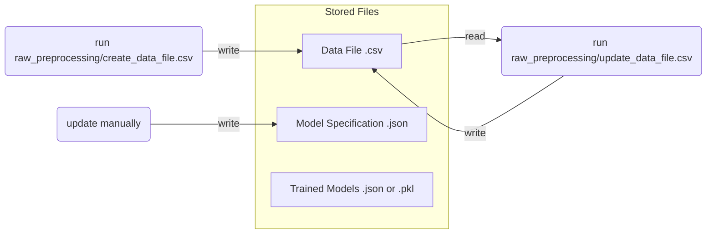

```mermaid
flowchart LR
    subgraph DataSources
        SCADA[SCADA loss]
        MEPS[MEPS weather data source]
    end

    SCADA -->|SCADA loss| DSF[Data storage file]
    MEPS --> DP((Data Preprocessing))
    DP --> DSF
    MEPS --> IM[Icing model]
    IM -->|Icing Intensity, Blade Ice Mass| DSF
```

```mermaid
flowchart LR
    subgraph Stored Files
        CSV[Data File .csv]
        MS[Model Specification .json]
        MF[Trained Models .json or .pkl]
    end
CCSV(run raw_preprocessing/create_data_file.csv) -->|write| CSV
UCSV(run raw_preprocessing/update_data_file.csv) -->|write| CSV
CSV -->|read| UCSV
UMS(update manually) -->|write| MS
```
