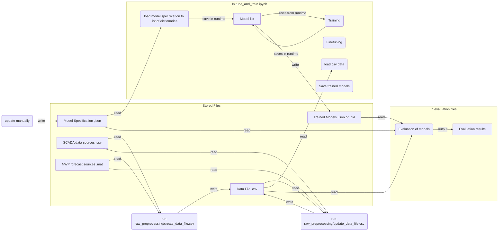

```mermaid
flowchart LR
    subgraph Stored Files
        CSV[Data File .csv]
        MS[Model Specification .json]
        MF[Trained Models .json or .pkl]
        SCADA[SCADA data sources .csv]
        NWP[NWP forecast sources .mat]
    end
    subgraph In tune_and_train.ipynb
        LCSV(load csv data)
        LMF(load model specification to list of dictionaries)
        FT(Finetuning)
        TR(Training)
        STR(Save trained models)
        LFR[Model list]
    end

    subgraph In evaluation files
        EV(Evaluation of models)
        EVR[Evaluation results]
    end
SCADA -->|read| CCSV
SCADA -->|read| UCSV
NWP -->|read| CCSV
NWP -->|read| UCSV
CCSV(run raw_preprocessing/create_data_file.csv) -->|write| CSV
UCSV(run raw_preprocessing/update_data_file.csv) -->|write| CSV
CSV -->|read| UCSV
UMS(update manually) -->|write| MS
CSV -->|read| LCSV
MS -->|read| LMF
LMF -->|save in runtime| LFR
LFR -->|uses from runtime| TR
TR -->|saves in runtime| LFR
LFR -->|write| MF
MS -->|read| EV
CSV -->|read| EV
MF --> |read| EV
EV --> |output| EVR
```
