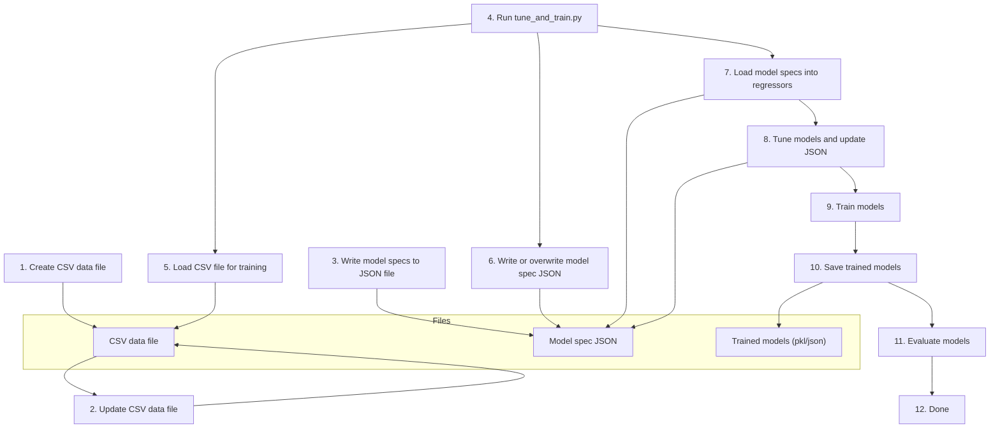

```mermaid
flowchart TD

subgraph Files
    CSV["CSV data file"]
    MODEL_JSON["Model spec JSON"]
    TRAINED_MODELS["Trained models (pkl/json)"]
end


A["1. Create CSV data file"] --> CSV
CSV --> B["2. Update CSV data file"]
B --> CSV  


C["3. Write model specs to JSON file"] --> MODEL_JSON

D["4. Run tune_and_train.py"]
D --> E["5. Load CSV file for training"]
E --> CSV

D --> F["6. Write or overwrite model spec JSON"]
F --> MODEL_JSON

D --> G["7. Load model specs into regressors"]
G --> MODEL_JSON

G --> H["8. Tune models and update JSON"]
H --> MODEL_JSON

H --> I["9. Train models"]
I --> J["10. Save trained models"]
J --> TRAINED_MODELS

J --> K["11. Evaluate models"]
K --> L["12. Done"]
```
