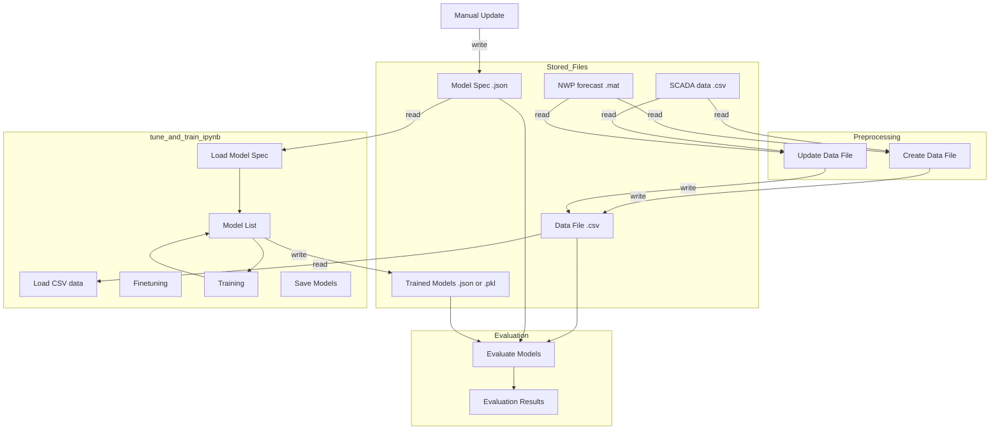

```mermaid
flowchart TB
    %% Stored Files
    subgraph Stored_Files
        CSV[Data File .csv]
        MS[Model Spec .json]
        MF[Trained Models .json or .pkl]
        SCADA[SCADA data .csv]
        NWP[NWP forecast .mat]
    end

    %% Preprocessing
    subgraph Preprocessing
        CCSV[Create Data File]
        UCSV[Update Data File]
    end

    %% Notebook
    subgraph tune_and_train_ipynb
        LCSV[Load CSV data]
        LMF[Load Model Spec]
        LFR[Model List]
        FT[Finetuning]
        TR[Training]
        STR[Save Models]
    end

    %% Evaluation
    subgraph Evaluation
        EV[Evaluate Models]
        EVR[Evaluation Results]
    end

    %% Manual update
    UMS[Manual Update]

    %% Data Flow
    SCADA -->|read| CCSV
    SCADA -->|read| UCSV
    NWP -->|read| CCSV
    NWP -->|read| UCSV
    CCSV -->|write| CSV
    UCSV -->|write| CSV
    CSV -->|read| LCSV
    MS -->|read| LMF
    UMS -->|write| MS
    LMF --> LFR
    LFR --> TR
    TR --> LFR
    LFR -->|write| MF
    CSV --> EV
    MS --> EV
    MF --> EV
    EV --> EVR
```
