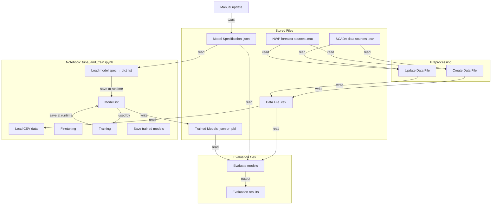

```mermaid
flowchart TB
    %% Stored Files
    subgraph "Stored Files"
        direction TB
        CSV["Data File .csv"]
        MS["Model Specification .json"]
        MF["Trained Models .json or .pkl"]
        SCADA["SCADA data sources .csv"]
        NWP["NWP forecast sources .mat"]
    end

    %% Preprocessing Step
    subgraph "Preprocessing"
        direction TB
        CCSV["Create Data File"]
        UCSV["Update Data File"]
    end

    %% Notebook: tune_and_train.ipynb
    subgraph "Notebook: tune_and_train.ipynb"
        direction TB
        LCSV["Load CSV data"]
        LMF["Load model spec → dict list"]
        LFR["Model list"]
        FT["Finetuning"]
        TR["Training"]
        STR["Save trained models"]
    end

    %% Evaluation files
    subgraph "Evaluation files"
        direction TB
        EV["Evaluate models"]
        EVR["Evaluation results"]
    end

    %% Manual Update
    UMS["Manual update"]

    %% Data Flow
    SCADA -->|read| CCSV
    SCADA -->|read| UCSV
    NWP -->|read| CCSV
    NWP -->|read| UCSV
    CCSV -->|write| CSV
    UCSV -->|write| CSV
    CSV -->|read| LCSV
    MS -->|read| LMF
    UMS -->|write| MS
    LMF -->|save at runtime| LFR
    LFR -->|used by| TR
    TR -->|save at runtime| LFR
    LFR -->|write| MF
    CSV -->|read| EV
    MS -->|read| EV
    MF -->|read| EV

    EV -->|output| EVR
```
