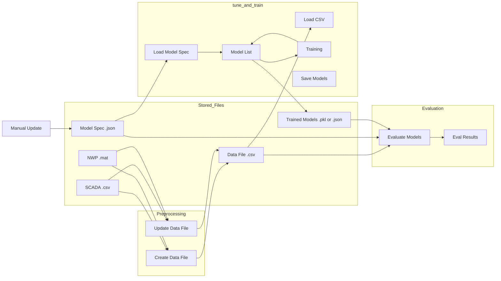

```mermaid
flowchart LR
    %% Stored Files
    subgraph Stored_Files
        SCADA[SCADA .csv]
        NWP[NWP .mat]
        CSV[Data File .csv]
        MS[Model Spec .json]
        MF[Trained Models .pkl or .json]
    end

    %% Preprocessing
    subgraph Preprocessing
        CCSV[Create Data File]
        UCSV[Update Data File]
    end

    %% Notebook
    subgraph tune_and_train
        LCSV[Load CSV]
        LMF[Load Model Spec]
        LFR[Model List]
        TR[Training]
        STR[Save Models]
    end

    %% Evaluation
    subgraph Evaluation
        EV[Evaluate Models]
        EVR[Eval Results]
    end

    %% Manual
    UMS[Manual Update]

    %% Connections
    SCADA --> CCSV
    SCADA --> UCSV
    NWP --> CCSV
    NWP --> UCSV
    CCSV --> CSV
    UCSV --> CSV

    CSV --> LCSV
    MS --> LMF
    UMS --> MS

    LMF --> LFR
    LFR --> TR
    TR --> LFR
    LFR --> MF

    CSV --> EV
    MS --> EV
    MF --> EV
    EV --> EVR
```
